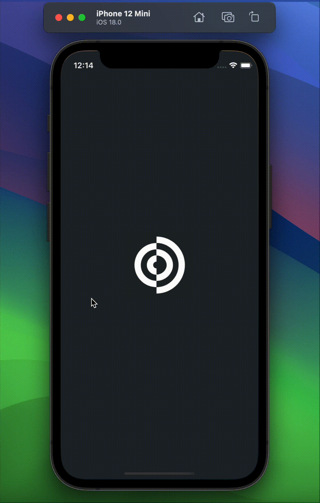
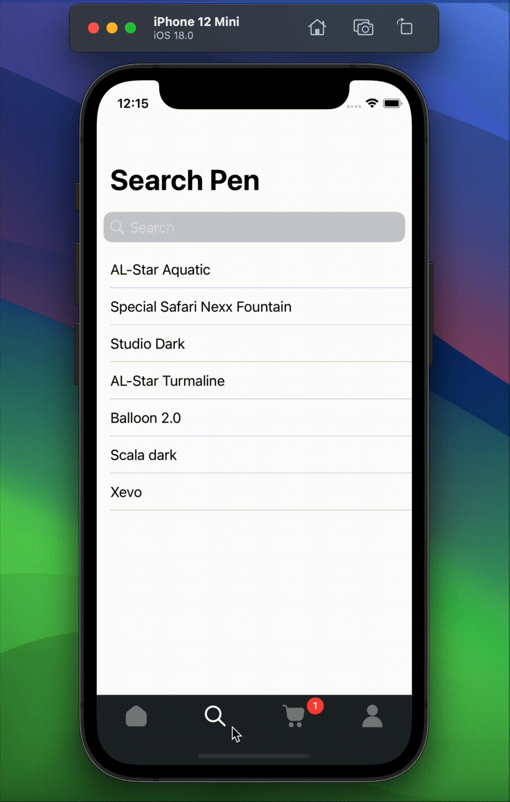
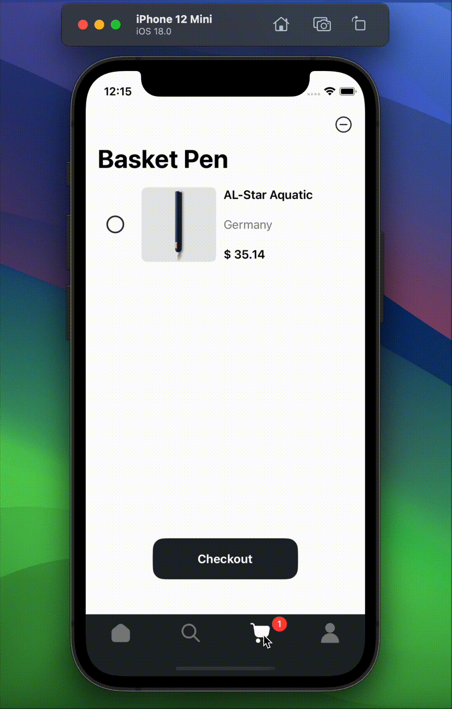

# Givy

Created using the UIKit framework. It took 1.5 months to create this. This is my first full application, which I worked on for a long time, and I’m glad to show it to you.

 

# Note

<ul>
    <li>Xcode 11 or later.</li>
    <li>iOS 13 or later in case of running it in a devices</li>
</ul>

# Contact me

<ul>
    <li>Instagram: <a href="https://www.instagram.com/mfcodes/" target="_blank">@mfcodes</a></li>
</ul>

# APP
Information Screen

Shopping Screen

Search Pen

Basket

Registration

About User

# Credits
© Maxim Fedoseenko | 2024
