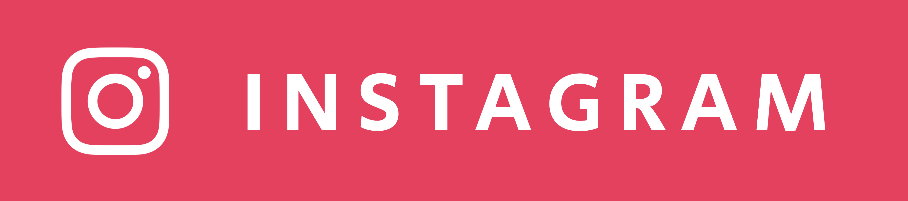

<h2>Hi there 👽</h2>

I'm Maxim Fedoseenko, an iOS Developer from Ukraine.

<ul>
    <li>Building apps for fun</li>
    <li>Sharing my learnings on socials</li>
</ul>

<h2>Connect with me</h2>

    
    
    

