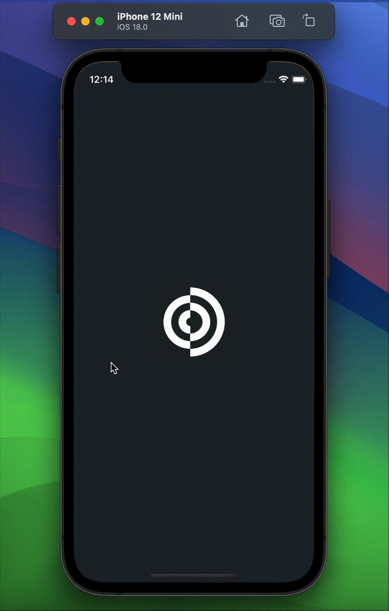
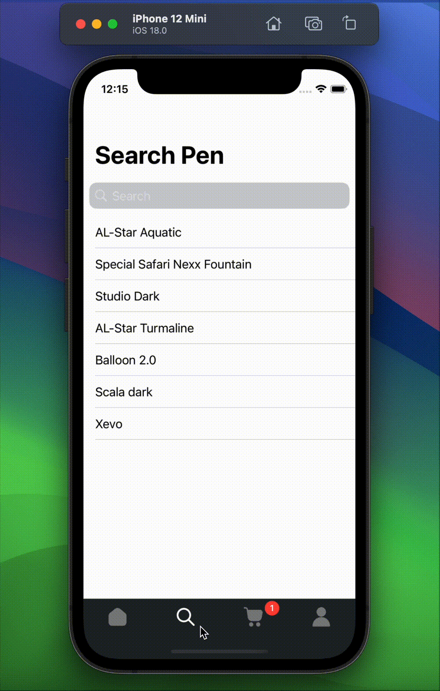
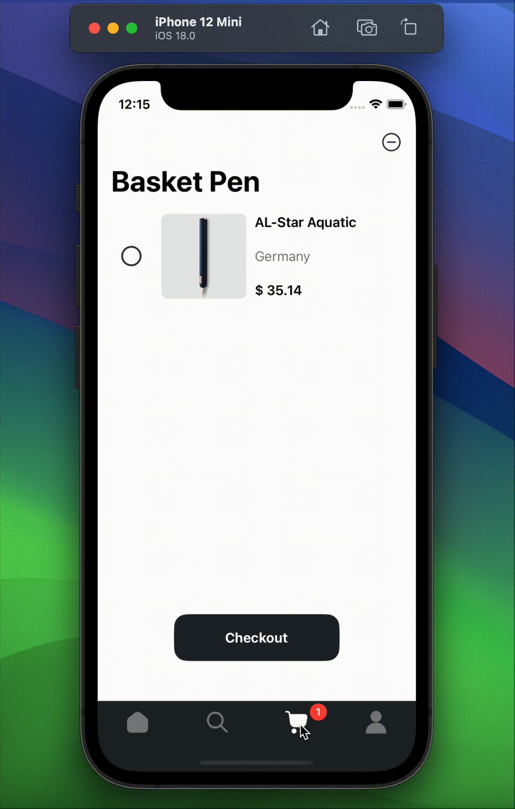

# Givy

Створено за допомогою фреймворку UIKit. На створення знадобилося 1,5 місяці. Це мій перший повноцінний додаток, над яким я працював довго, і я радий показати його вам. 🙂

 

# Примітка

<ul>
    <li>Xcode 11 або новішої версії</li>
    <li>iOS 13 або новішої версії, якщо її запущено на пристроях</li>
</ul>

# Contact me

<ul>
    <li>Instagram: <a href="https://www.instagram.com/maxfeds/" target="_blank">@maxfeds</a></li>
</ul>

# APP
Інформаційний екран

Екран покупок

Пошукова ручка

Кошик

Реєстрація

Про користувача

# Credits
© Maxim Fedoseenko | 2024
